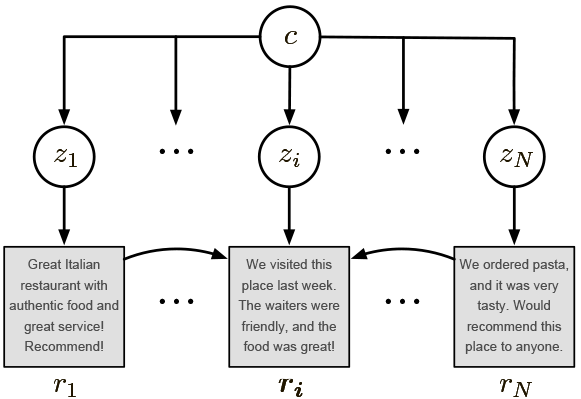

# Unsupervised Opinion Summarization as Copycat-Review Generation

This repository contains the Python (PyTorch) codebase of [the corresponding paper](https://arxiv.org/abs/1911.02247
) accepted at ACL 2020, Seattle, USA.


<p align="center">

</p>

The model is fully **unsupervised** and is trained on a large corpus of customer reviews, such as Yelp or Amazon. It generates **abstractive** summaries condensing common opinions across a group of reviews.  It relies on Bayesian auto-encoding that fosters learning rich hierarchical semantic representations of reviews and products. Finally, the model uses a copy mechanism to better preserve details of input reviews.

Example summaries produced by the system are shown below.


* *This restaurant is a hidden gem in Toronto. The food is delicious, and the service is impeccable. Highly recommend for anyone who likes French bistro.*

* *This is a great case for the Acer Aspire 14" laptop. It is a little snug for my laptop, but it's a nice case. I would recommend it to anyone who wants to protect their laptop.*

* *This is the best steamer I have ever owned. It is easy to use and easy to clean. I have used it several times and it works great. I would recommend it to anyone looking for a steamer.*


For more examples, please refer to the [artifacts folder](copycat/artifacts/).

## Installation

The easiest way to proceed is to create a separate [conda environment](https://docs.conda.io/en/latest/).

```
conda create -n copycat python=3.6.9
```

```
conda activate copycat
```

Install required modules.

```
pip install -r requirements.txt
```

Add the root directory to the path.

```
export PYTHONPATH=root_path:$PYTHONPATH
```

## Data

Our model is trained on two different collections of customer reviews - [Amazon](https://cseweb.ucsd.edu/~jmcauley/datasets.html) and [Yelp](https://www.yelp.nl/dataset/challenge). The evaluation was performed on human-annotated summaries based on both datasets.

### Unsupervised data

The dataset for [Yelp](https://abrazinskas.s3-eu-west-1.amazonaws.com/downloads/projects/copycat/data/yelp.zip) and [Amazon](https://abrazinskas.s3-eu-west-1.amazonaws.com/downloads/projects/copycat/data/amazon.zip) can be downloaded and put to the `/data` folder with amazon and yelp folders. 

If one needs to preprocess data from raw files, please refer to [provided preprocessing scripts](preprocessing/)

### Input Data Format

If training should be performed on a separate dataset, the expected format of input is provided in [artifacts](artifacts/amazon/data/input_example). Each business/product has to be separated to CSV files where each line corresponds to a separate review.


group_id | review_text | rating | category
--- | --- | --- | ---
159985130X | We recommend the Magnifier ...  | 4.0 | health_and_personal_care

The rating column is optional as it is not used by the model.

### Evaluation Summaries

Evaluation can be performed on human-created summaries, both [Amazon](gold_summs/) and [Yelp](https://github.com/sosuperic/MeanSum) summaries are publicly available. No preprocessing is needed for evaluation.
The Amazon summaries were created by us using the Mechanical Turk Platform, more information on the process can be found in the corresponding folder.

## Running

If you preprocessed data yourself, please create your vocabulary and truecaser. Otherwise, you can skip the following two sections.

### Vocabulary Creation

Vocabulary contains to a mapping from words to frequency, where file position corresponds to ids used by the model.

```
python copycat/scripts/create_vocabulary.py --data_path=your_data_path --vocab_fp=data/dataset_name/vocabs/vocab.txt
```

### Truecaser Creation
Truecaser is used to reverse lowercase letters, and needs to be trained (quickly) by scanning the dataset. Note that multiple folders can be assigned to the `data_path` parameter.

```
python copycat/scripts/train_truecaser.py --data_path=your_data_path --tcaser_fp=data/dataset_name/tcaser.model
```

### Workflow

One needs to set parameters of the workflow in `copycat/hparams/run_hp.py`. E.g., by altering data paths or specifying the number of training epochs.

The file `run_workflow.py` contains a workflow of operations that are executed to prepare necessary objects (e.g., beam search) and then run a training and/or evaluation procedure.
After adjusting run parameters, execute the following command.

```
python copycat/scripts/run_workflow.py
```


### Summary generation

Generation of summaries from CSV files can also be done via the `run_workflow.py` file. The input must be in the CSV format as in `copycat/amazon/data/infer_input.csv`.
Each review column must be in the format 'rev1', ..., 'revN'. Tab should be used as a separator.

```
python copycat/scripts/run_workflow.py --infer-input-file-path=your_csv_input_file_path --infer-batch-size=20
```


### Checkpoints

[Amazon](https://drive.google.com/open?id=143BhjMPL5vdNdjk0-duAz4LBB7FBVhXx) and [Yelp](https://drive.google.com/open?id=1wy8lpokZqf3KygQQJTLrPVT7q6Ok3Hgr) checkpoints are available for download. Please put them to `copycat/artifacts/`, to the corresponding dataset sub-folders.

## LICENSE

MIT


## Citation

```
@inproceedings{brazinskas2020-unsupervised,
    title = "Unsupervised Opinion Summarization as Copycat-Review Generation",
    author = "Bra{\v{z}}inskas, Arthur  and
      Lapata, Mirella  and
      Titov, Ivan",
    booktitle = "Proceedings of the 58th Annual Meeting of the Association for Computational Linguistics",
    month = jul,
    year = "2020",
    address = "Online",
    publisher = "Association for Computational Linguistics",
    url = "https://www.aclweb.org/anthology/2020.acl-main.461",
    doi = "10.18653/v1/2020.acl-main.461",
    pages = "5151--5169"
}
```


## Notes

* Minor deviations from the published results are expected as the code was migrated from a bleeding-edge PyTorch version and Python 2.7.

* Post factum, we added a **beam search generator** that has the **n-gram blocking functionality** (based on OpenNMT). The enhancement reduces repetitions.

* The setup was fully tested with **Python 3.6.9**.

* The model work on a single GPU only.

* **mltoolkit** provides the backbone functionality for data processing and modelling. Make sure it's visible to the interpreter.

* We improved unsupervised data preprocessing, and thus the data statistics differ slightly from the ones mentioned in the paper.
