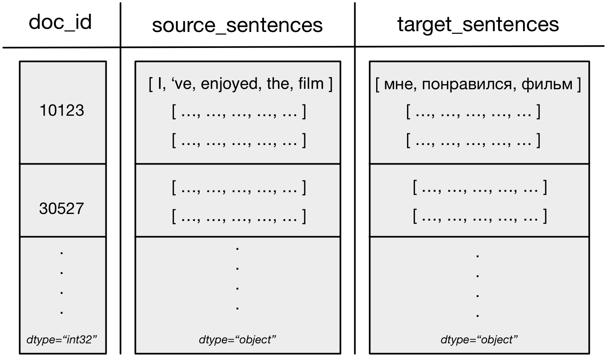

# Machine Learning Data Pipeline (MLDP) #

This repository contains a module for **parallel** and **real-time data processing** for machine learning (ML) purposes. It provides the backbone to perform data transformations to train and evaluate ML models. A data pipeline can be understood as a sequence of computational steps that are applied to data-chunks that are read progressively (opposed to reading all data to the main memory at once), as shown below. The final output of the data pipeline are data-chunks (batches) in a desired format, which will depend on a model at hand.


As opposed to a common meaning of data pipeline, the module focuses on providing data-chunks in real-time, as fast as possible, assuming that a data processing procedure might change over the course of experiments series.

Because similar computational steps can in principle be applied to different ML projects, the main problem is that it's not straightforward to apply them to data in a different format.
Fortunately, the pipeline passes a light-weight intermediate data format across steps. Therefore, **computational steps can be reused** as their input will always be of the same format regardless of whether your data is in csv, xml, or some other format.

Finally, a need for experiments reproducibility is considered by **documentation generation**. Such that it would be possible to rerun an older experiment and obtain the same results, or simply lookup what setup has been used in a previous model run. To facilitate that, the module allows documentation generation of pipeline setups and individual components that were used to process data.

It is similar to the Tensorflow's and PyTorch's data pipeline. The main difference, however, is that the main focus of this module is on re-usability of computational steps instead of provision of the computational framework for parallel processing.

The module was fully tested with **Python 3.6.9**.


## MLDP main features ##

* Parallel data processing.
* Automatic documentation generation of data pipelines and individual steps.
* Independence of other machine learning libraries, such as TensorFlow.
* A set of implemented steps that can be used out-of-the-box for data processing, such as a csv reader, vocabulary mapper, padder, and token processor.

The module does not provide an exhaustive set of computational steps, and a user has a complete freedom to write own steps in Python, and use any extra libraries that he might wish.

## Usage ##

### Example ###
```python
from mltoolkit.mldp.pipeline import Pipeline
from mltoolkit.mldp.steps.readers import CsvReader
from mltoolkit.mldp.steps.transformers.nlp import TokenProcessor, Padder
from mltoolkit.mldp.steps.transformers.field import FieldSelector

data_path = "mldp/tests/data/tweets.csv"

# creating steps
csv_reader = CsvReader(sep='\t', chunk_size=30)
fields_selector = FieldSelector(fnames=["tweets", "labels"])
token_processor = TokenProcessor(fnames="tweets",
                                 tokenization_func=lambda x: x.split(),
                                 lower_case=True)
padder = Padder(fname="tweets", new_mask_fname="tweets_mask", pad_symbol="<PAD>")

# creating a pipeline object and attaching the steps
pipeline = Pipeline(reader=csv_reader, worker_processes_num=1)
pipeline.add_step(fields_selector)
pipeline.add_step(token_processor)
pipeline.add_step(padder)

# iterating over data-chunks
for data_chunk in pipeline.iter(data_path=data_path):
    pass

# generating the blue-print (documentation) and printing it
print(pipeline)
```
Here, we create the **Pipeline** object that gets three steps attached that perform a transformation of the initial tweets stored on the local storage device.

### Implementation of custom steps ###

In order to implement custom steps, the user has to extend the base class of a desired step's type. For example, to write a custom reader, the user needs to extend **BaseReader** from **mldp/steps/readers/base_reader.py**.

Please remember that all steps are required to output data-chunks in the **intermediate format** as explained below.

## Main principles ##

### Computational step types ###

1. **Readers** - fetch data from a remote or local storage and convert it to the intermediate data-chunk format (dict of numpy arrays). E.g., CSV files or JSON readers.
2. **Transformers** - transform field values of data-chunks or create new data-chunk fields. E.g. a Padder that makes all sequences to be of the same length.
3. **Formatters** - convert the intermediate data-chunk format to a project specific data format. E.g. steps that convert to pandas data-frames or tuples (features, labels).
5. **Preprocessors** - while preprocessing is not the main focus of the module, steps of this kind allow to perform data alteration and caching for multiple subsequent re-use during processing steps execution. For example, a step of this kind could pre-load remote data, or perform some data cleaning. Operations in this step are usually necessary to execute only once, then save the result, and use it for processing runs without re-execution of the step.


### Intermediate format ###

A **Pipeline** object expects the format of flowing data-chunks to be of the **DataChunk** class. They corresponding objects essentially contain **dictionaries** mapping to lists or numpy arrays. The main argument behind the decision is the code re-usability of steps that assume the format of the dictionary values. Nevertheless, the format is not restricted, and one can use an arbitrary data type for the dictionary values.

More specifically, data-chunks have **fnames** (dict keys) corresponding to data attributes (e.g. "text_id", "text", "label"). And **fvalues** (dict values) corresponding to data-unit values, for example the actual *text ids*, or *text* strings.

An example data-chunk for machine translation is shown below.



The shaded rectangles correspond to numpy arrays of different types but with the same first dimension (i.e the same length). Note that numpy arrays can contain arbitrary types besides standard floats and ints.

## License ##

MIT